# 👨‍💻 Gintas Indriliunas — Projects

**Software Engineer · DevSecOps · Full Stack Developer**

[](https://linkedin.com/in/gintas-indriliunas-75778b51)
[](https://github.com/gindriliunas)

---

## 📋 Projects Overview

| Project | Stack | Type | Live |
|---|---|---|---|
| [🏥 Health & Fitness Booking Platform](#-health--fitness-booking-platform) | Next.js · AWS ECS · RDS · Terraform | Full Stack + DevSecOps | [Demo](https://loom.com/share/deb83c6d095744ad9b8379a9081086de) |
| [🍽️ Serverless Food Ordering Platform](#-serverless-food-ordering-platform) | Vue 3 · Lambda · DynamoDB · SNS/SQS | Serverless + DevSecOps | [Demo](https://loom.com/share/d52573db16ca434ab8f77a9aaece8466) |
| [📦 Order Management System](#-order-management-system) | Node.js · Express · Vue 3 | Full Stack REST API | [GitHub](https://github.com/gindriliunas/Ordering) |
| [💬 WhatsApp Clone](#-whatsapp-clone) | Next.js · Firebase · Realtime | Real-time Messaging | [GitHub](https://github.com/gindriliunas/whatsapp-clone) |

---

## 🏥 Health & Fitness Booking Platform

> A production-grade multi-tenant booking platform for health and fitness professionals — built on AWS with a full DevSecOps CI/CD pipeline integrated at every stage.

📹 **[Demo — Provider Dashboard & Booking Flow](https://loom.com/share/deb83c6d095744ad9b8379a9081086de)**
🔗 **[github.com/gindriliunas/booking-platform](https://github.com/gindriliunas/booking-platform)**

### Architecture

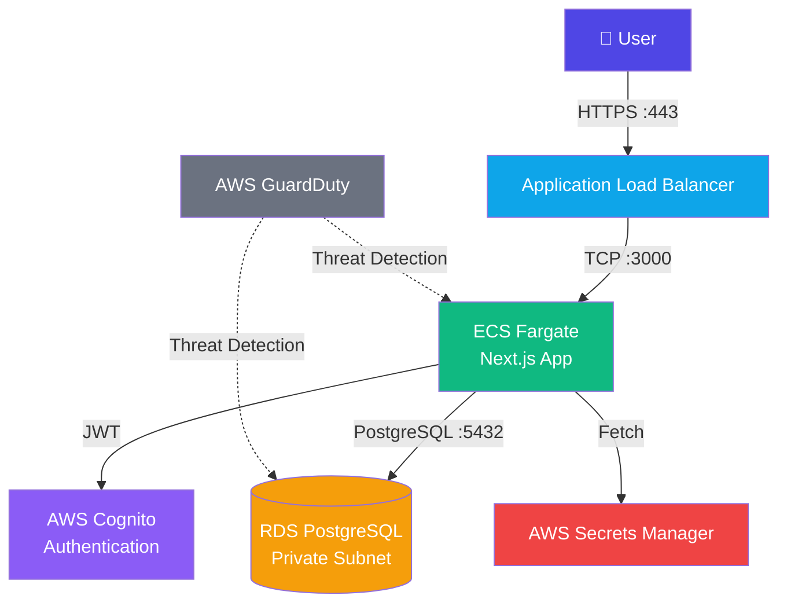

### DevSecOps Pipeline

```mermaid
flowchart LR
    A[📝 Code Push] --> B[Gitleaks\nSecret Scan]
    B --> C[Snyk\nDependency CVEs]
    C --> D[CodeQL\nStatic Analysis]
    D --> E[Trivy\nContainer Scan]
    E --> F[Checkov + tfsec\nTerraform IaC]
    F --> G[OWASP ZAP\nDAST]
    G --> H[✅ Deploy\nto ECS]

    style A fill:#374151,color:#fff
    style B fill:#EF4444,color:#fff
    style C fill:#EF4444,color:#fff
    style D fill:#EF4444,color:#fff
    style E fill:#EF4444,color:#fff
    style F fill:#EF4444,color:#fff
    style G fill:#EF4444,color:#fff
    style H fill:#10B981,color:#fff
```

### Tech Stack

```
Next.js 14 · TypeScript · Tailwind CSS
AWS ECS Fargate · RDS PostgreSQL · Cognito · Secrets Manager · GuardDuty
Drizzle ORM · Terraform · GitHub Actions
Snyk · CodeQL · Trivy · Checkov · tfsec · OWASP ZAP · Gitleaks
```

---

## 🍽️ Serverless Food Ordering Platform

> A fully serverless food ordering system on AWS — using event-driven architecture with SNS/SQS for async order processing, Cognito auth, and a Terraform-provisioned infrastructure.

📹 **[Demo — Order Flow & Real-Time Confirmation](https://loom.com/share/d52573db16ca434ab8f77a9aaece8466)**
🔗 **[github.com/gindriliunas/food-ordering](https://github.com/gindriliunas/food-ordering)**

### Architecture

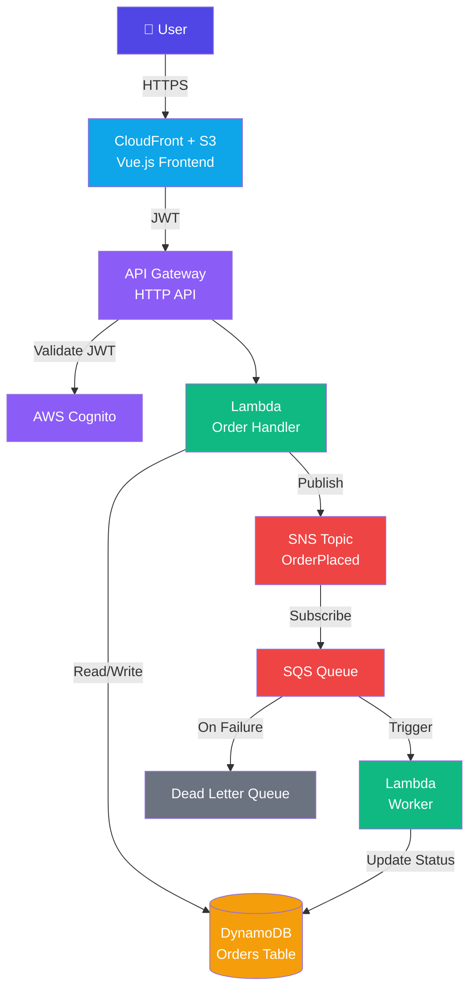

### Order Flow

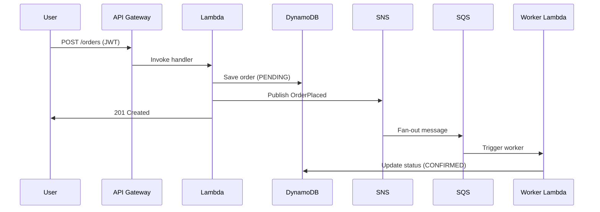

### Tech Stack

```
Vue 3 · Vite · TypeScript (Frontend)
Node.js 20 · Lambda · API Gateway · DynamoDB · SNS · SQS
AWS Cognito · CloudFront · S3 · Terraform
GitHub Actions · tfsec · npm audit · Jest
```

---

## 📦 Order Management System

> A full-stack order management system with a Node.js/Express REST API and Vue 3 frontend — featuring comprehensive server-side validation, order history, and product catalogue integration.

🔗 **[github.com/gindriliunas/Ordering](https://github.com/gindriliunas/Ordering)**

### Application Flow

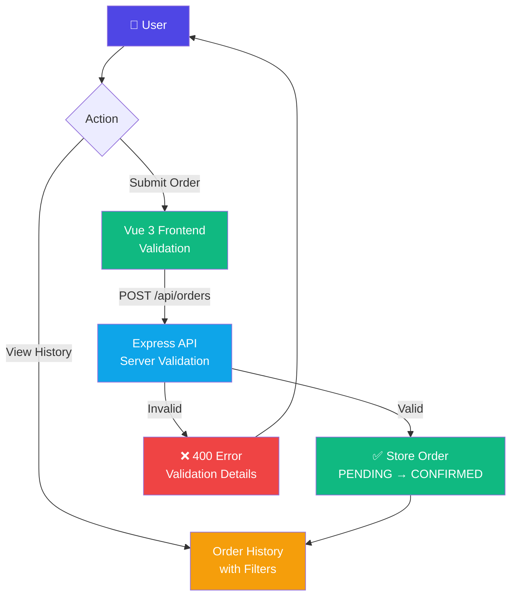

### Validation Rules

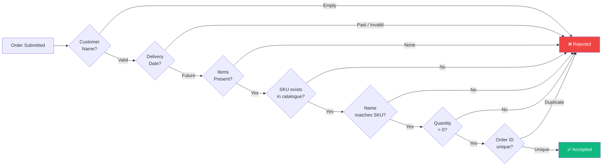

### Tech Stack

```
Node.js · Express · TypeScript (Backend)
Vue 3 · Vite · TypeScript (Frontend)
In-memory storage · Vercel deployment
```

---

## 💬 WhatsApp Clone

> A real-time messaging web app built with Next.js and Firebase — featuring Google authentication, live Firestore listeners, and a responsive UI that matches WhatsApp Web.

🔗 **[github.com/gindriliunas/whatsapp-clone](https://github.com/gindriliunas/whatsapp-clone)**

### Real-time Architecture

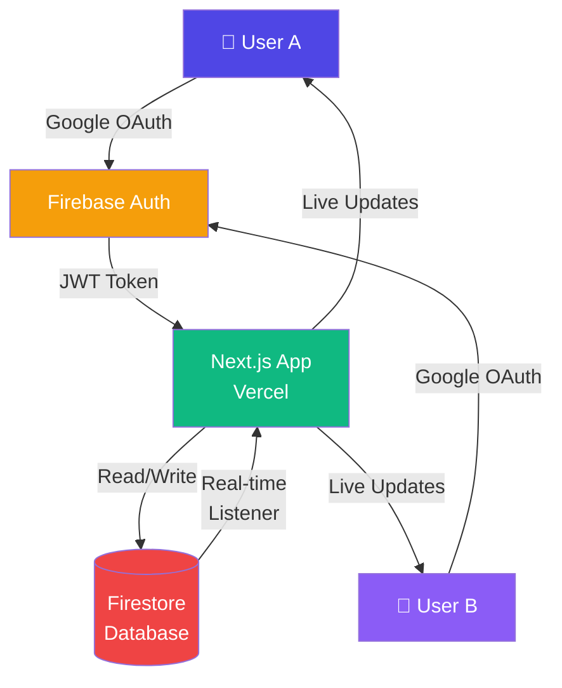

### Message Flow

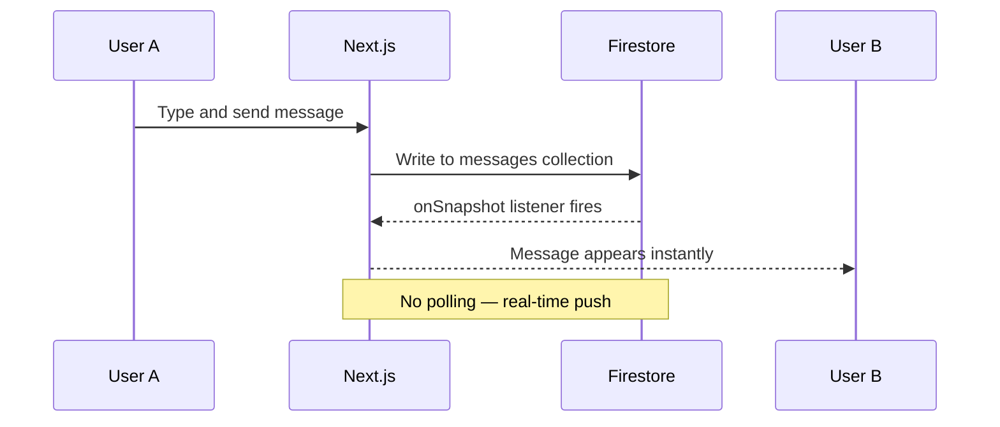

### Tech Stack

```
Next.js 14 · React · TypeScript · Tailwind CSS
Firebase Firestore · Firebase Auth (Google OAuth)
Vercel · Cursor IDE
```

---

## 🧪 Security Labs

Hands-on cybersecurity labs covering real-world attack and defence scenarios — using Splunk, Nessus, Wireshark, Burp Suite, and Jira.

👉 **[Full lab portfolio — github.com/gindriliunas/Gintas-Indriliunas](https://github.com/gindriliunas/Gintas-Indriliunas)**

| Lab | Focus | Tools | Video |
|---|---|---|---|
| Lab 1 — SIEM Setup & Monitoring | Splunk alert rules, failed login detection, log clearing simulation | Splunk, Windows Event Manager | [▶ Watch](https://www.youtube.com/watch?v=QhVx4lV4IQk) |
| Lab 2 — Vulnerability Scanning | Network asset mapping, 14 high-risk CVEs discovered, remediation | Nessus | [▶ Watch](https://www.youtube.com/watch?v=1aIY9tGRVtM) |
| Lab 3 — Network Traffic Analysis | Suspicious outbound traffic, compromised VM, data exfiltration | Wireshark, Tcpdump | — |
| Lab 4 — Web Application Attacks | SQL injection, XSS exploitation, secure coding countermeasures | Kali Linux, Burp Suite | — |
| Lab 5 — Phishing Incident Response | Spear phishing simulation, root cause analysis, incident report | Email forensics | [▶ Watch](https://youtu.be/7m7Va6tINVE) |
| Lab 6 — Jira SOC Ticket Workflow | SOC ticket lifecycle, detection → triage → remediation → closure | Jira | — |

---

## 🔐 Security Approach

All projects follow a shift-left security philosophy — security checks integrated into the development workflow, not bolted on after:


---

## 📊 Skills Demonstrated

| Skill | Projects |
|---|---|
| AWS Cloud Architecture | Booking Platform, Food Ordering |
| Serverless / Lambda | Food Ordering |
| DevSecOps Pipelines | Booking Platform, Food Ordering |
| Infrastructure as Code (Terraform) | Booking Platform, Food Ordering |
| Real-time Systems | WhatsApp Clone |
| REST API Design | Ordering, Food Ordering |
| Multi-tenant SaaS | Booking Platform |
| Event-driven Architecture | Food Ordering |
| TypeScript | All Projects |
| AI-assisted Development | WhatsApp Clone |

---

*Built by Gintas Indriliunas · [linkedin.com/in/gintas-indriliunas-75778b51](https://linkedin.com/in/gintas-indriliunas-75778b51)*

---

## 🌐 Client Websites

Production websites built for real businesses — designed, developed, and deployed end-to-end using Next.js, Tailwind CSS, GoHighLevel CRM integration, SEO, and Meta/Google Ads.

| Business | Industry | Tech | Live |
|---|---|---|---|
| [Skills 42U](#-skills-42u) | First Aid Training | Next.js · GoHighLevel · CRM | [skills42u.com](https://www.skills42u.com) |
| [Leaf It Out](#-leaf-it-out) | Landscaping | Next.js · Tailwind | [leaf-it-out.co.uk](https://www.leaf-it-out.co.uk) |
| [A Cut Above](#-a-cut-above) | Hair Salon & Aesthetics | Next.js · Tailwind | [acutabovehairsalon.co.uk](https://www.acutabovehairsalon.co.uk) |
| [Plumbing Boss](#-plumbing-boss) | Plumbing & Heating | Next.js · GoHighLevel · CRM | [plumbingboss.co.uk](https://plumbingboss.co.uk) |
| [GI Training](#-gi-training) | Personal Training | Next.js · Tailwind | [gitraining.co.uk](https://www.gitraining.co.uk) |

---

### 🏥 Skills 42U

> Accredited first aid training for Kent businesses — delivered on-site. HSE-compliant, Ofqual-regulated.

**[skills42u.com](https://www.skills42u.com)**

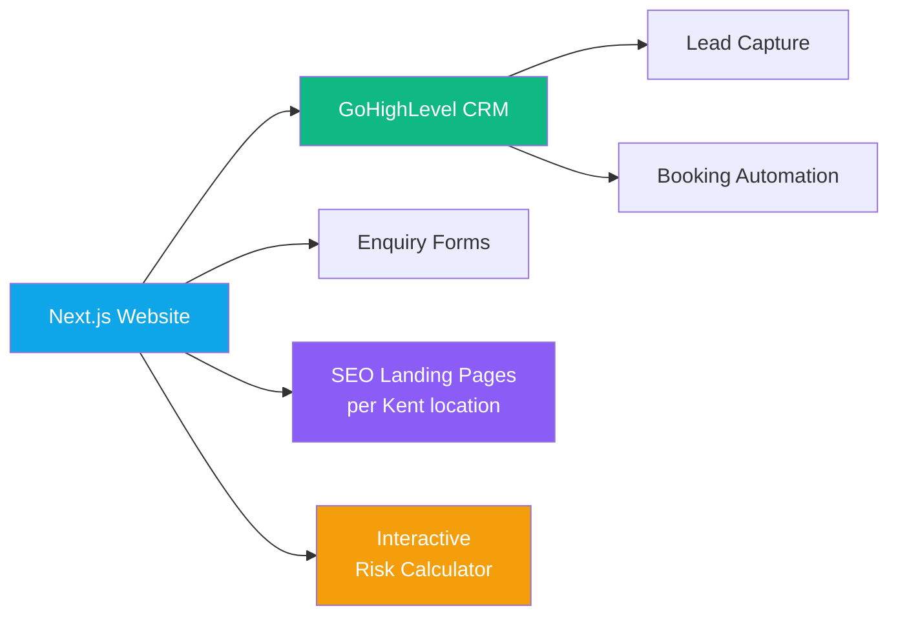

**Key features:**
- Interactive workplace risk calculator — HSE 2024/25 data by industry and team size
- Location-specific SEO landing pages — Medway, Maidstone, Dartford, Ashford, Tunbridge Wells
- GoHighLevel CRM integration — lead capture, automated follow-up, booking confirmation
- Competitor comparison table — transparent pricing vs other Kent providers
- 600+ courses delivered across Kent and South East

---

### 🌿 Leaf It Out

> Family run landscaping business serving Medway and Kent for 15+ years — driveways, patios, garden transformations.

**[leaf-it-out.co.uk](https://www.leaf-it-out.co.uk)**

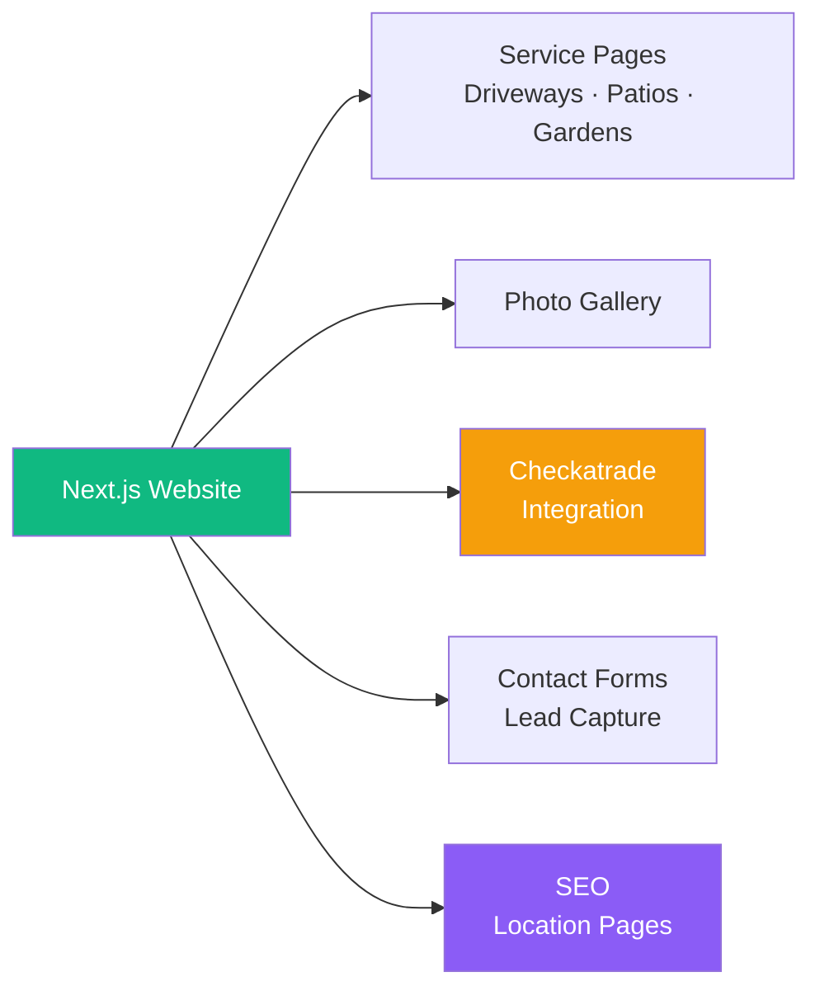

**Key features:**
- Full project gallery — before/after transformations across Kent
- Checkatrade approved badge and independently verified reviews
- Location SEO — Chatham, Rochester, Gillingham, Maidstone, and surrounding areas
- Service pages — driveways, block paving, patios, natural stone, decking, fencing, water features
- Mobile-first responsive design with fast loading image optimisation

---

### ✂️ A Cut Above

> Unisex hair salon and BA Aesthetics clinic in Chatham, Medway — hair colouring, balayage, barber services, and medical aesthetics.

**[acutabovehairsalon.co.uk](https://www.acutabovehairsalon.co.uk)**

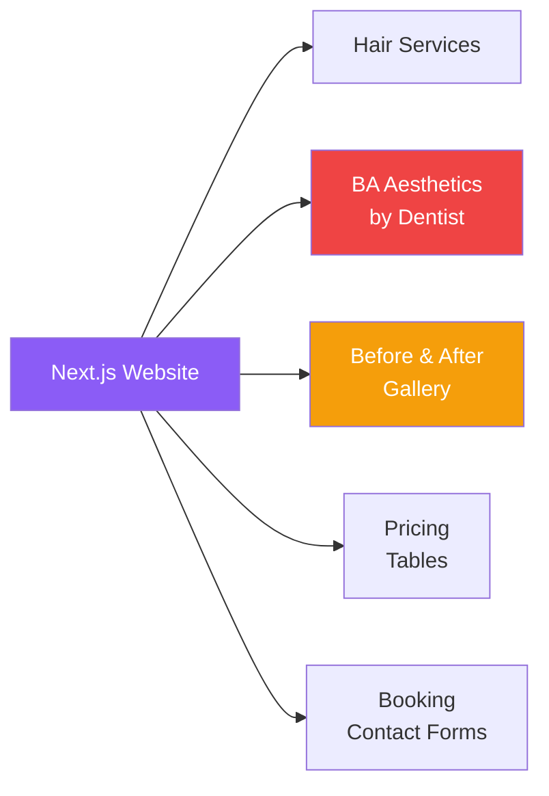

**Key features:**
- Dual-service site — hair salon and medical aesthetics (lip fillers, botox, PRP, rhinoplasty)
- Full before/after gallery — balayage, highlights, bridal, extensions, barber
- Aesthetics pricing tables — Botox, facial filler, lip filler, skin boosters, PRP
- Google Maps integration — Chatham ME5 location
- Local SEO — Chatham, Rochester, Gillingham, Strood, Medway

---

### 🔧 Plumbing Boss

> Gas Safe registered plumbers in Medway, Kent — boiler installation, emergency repairs, central heating.

**[plumbingboss.co.uk](https://plumbingboss.co.uk)**

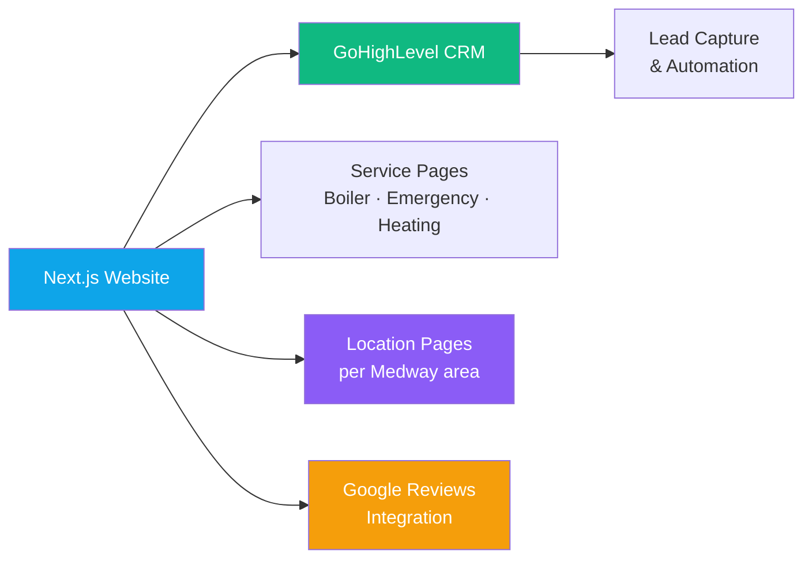

**Key features:**
- Service-specific landing pages — boiler installation, plumbing repairs, heating engineer, emergency plumber
- Location pages — Chatham, Rochester, Gillingham, Strood, Maidstone
- GoHighLevel CRM — instant lead capture and follow-up automation
- Google Reviews integration — 5-star verified reviews displayed
- Worcester Bosch and Vaillant accredited installer badges

---

### 💪 GI Training

> Online personal training and coaching — fat loss, strength training, nutrition, and behaviour change.

**[gitraining.co.uk](https://www.gitraining.co.uk)**

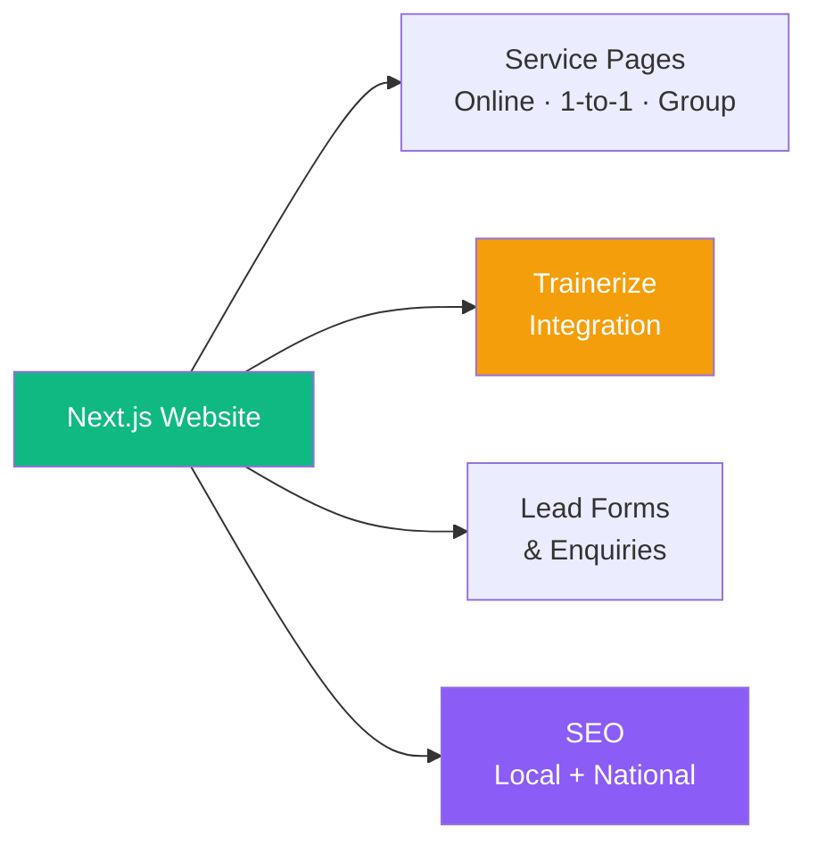

**Key features:**
- Online coaching services — 1-to-1 video, group video, Trainerize programme delivery
- Nutrition and behaviour change coaching pages
- 14 years of personal training experience showcased
- Local SEO — Kent and Medway
- Lead capture and consultation booking forms

---

### 🛠️ Website Tech Stack

All client websites are built using the same production-grade stack:

```
Next.js 14 · React · TypeScript · Tailwind CSS
GoHighLevel CRM (lead capture + automation) — Skills 42U, Plumbing Boss
Vercel deployment · Custom domains · SSL
Local SEO — location-specific landing pages per service area
Google Analytics + Search Console integration
Meta Ads + Google Ads campaign support
```

---

*Built by Gintas Indriliunas · [viv-z.com](https://www.viv-z.com) · [linkedin.com/in/gintas-indriliunas-75778b51](https://linkedin.com/in/gintas-indriliunas-75778b51)*
