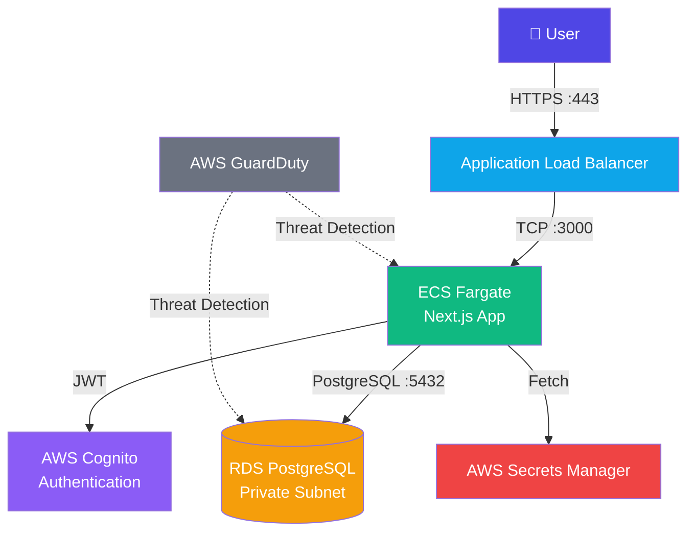
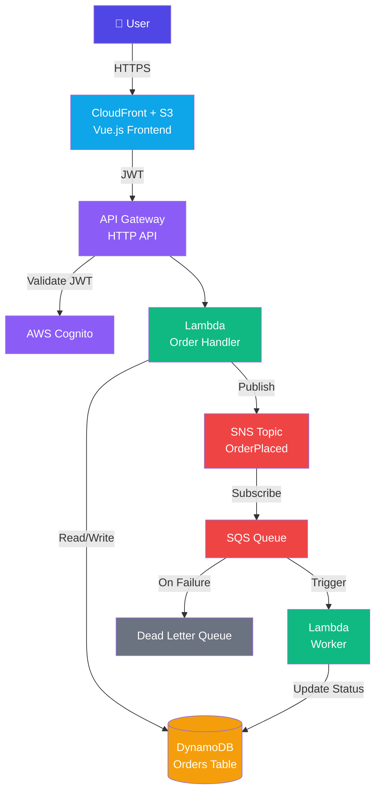
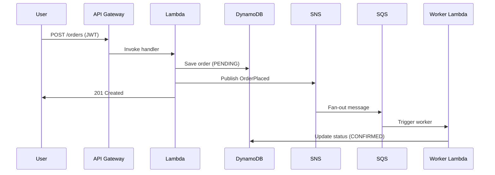
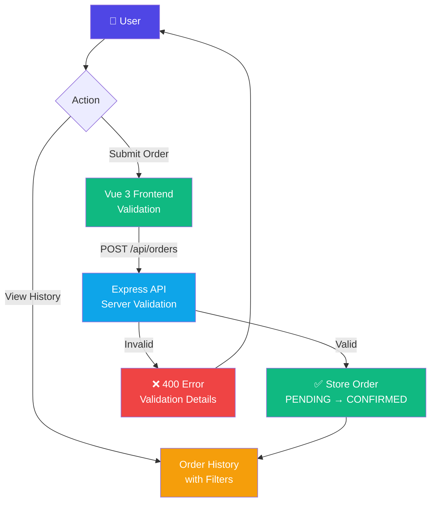
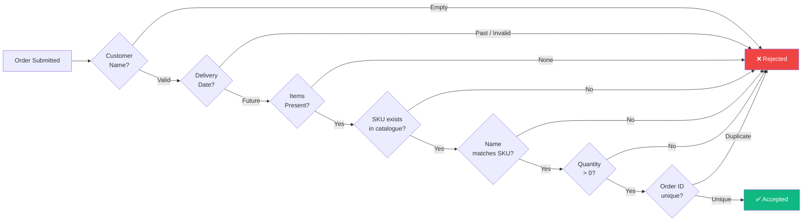
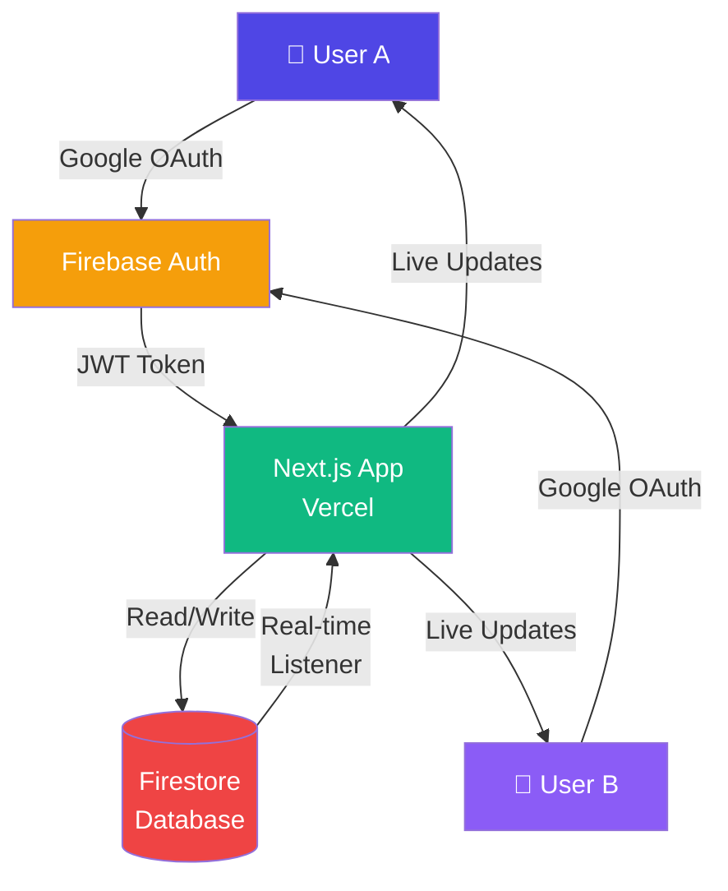
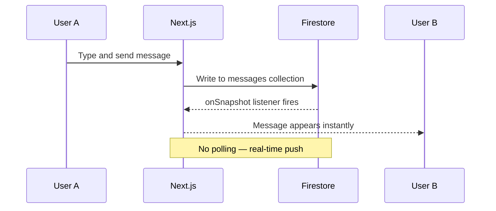

# 👨‍💻 Gintas Indriliunas — Projects

**Software Engineer · DevSecOps · Full Stack Developer**

[](https://linkedin.com/in/gintas-indriliunas-75778b51)
[](https://github.com/gindriliunas)

---

## 📋 Projects Overview

| Project | Stack | Type | Live |
|---|---|---|---|
| [🏥 Health & Fitness Booking Platform](#-health--fitness-booking-platform) | Next.js · AWS ECS · RDS · Terraform | Full Stack + DevSecOps | [Demo 1](https://loom.com/share/deb83c6d095744ad9b8379a9081086de) · [Demo 2](https://loom.com/share/5eadbfc7a18d4201b) |
| [🍽️ Serverless Food Ordering Platform](#-serverless-food-ordering-platform) | Vue 3 · Lambda · DynamoDB · SNS/SQS | Serverless + DevSecOps | [Demo](https://loom.com/share/d52573db16ca434ab8f77a9aaece8466) |
| [📦 Order Management System](#-order-management-system) | Node.js · Express · Vue 3 | Full Stack REST API | [Live](https://ordering-theta-neon.vercel.app) |
| [💬 WhatsApp Clone](#-whatsapp-clone) | Next.js · Firebase · Realtime | Real-time Messaging | [Live](https://whatsapp-clone-three-teal.vercel.app) |

---

## 🏥 Health & Fitness Booking Platform

> A production-grade multi-tenant booking platform for health and fitness professionals — built on AWS with a full DevSecOps CI/CD pipeline integrated at every stage.

📹 **[Demo 1 — Provider Dashboard](https://loom.com/share/deb83c6d095744ad9b8379a9081086de)** · **[Demo 2 — Client Portal](https://loom.com/share/5eadbfc7a18d4201b)**
🔗 **[github.com/gindriliunas/booking-platform](https://github.com/gindriliunas/booking-platform)**

### Architecture



### DevSecOps Pipeline

```mermaid
flowchart LR
    A[📝 Code Push] --> B[Gitleaks\nSecret Scan]
    B --> C[Snyk\nDependency CVEs]
    C --> D[CodeQL\nStatic Analysis]
    D --> E[Trivy\nContainer Scan]
    E --> F[Checkov + tfsec\nTerraform IaC]
    F --> G[OWASP ZAP\nDAST]
    G --> H[✅ Deploy\nto ECS]

    style A fill:#374151,color:#fff
    style B fill:#EF4444,color:#fff
    style C fill:#EF4444,color:#fff
    style D fill:#EF4444,color:#fff
    style E fill:#EF4444,color:#fff
    style F fill:#EF4444,color:#fff
    style G fill:#EF4444,color:#fff
    style H fill:#10B981,color:#fff
```



### Tech Stack

```
Next.js 14 · TypeScript · Tailwind CSS
AWS ECS Fargate · RDS PostgreSQL · Cognito · Secrets Manager · GuardDuty
Drizzle ORM · Terraform · GitHub Actions
Snyk · CodeQL · Trivy · Checkov · tfsec · OWASP ZAP · Gitleaks
```

---

## 🍽️ Serverless Food Ordering Platform

> A fully serverless food ordering system on AWS — using event-driven architecture with SNS/SQS for async order processing, Cognito auth, and a Terraform-provisioned infrastructure.

📹 **[Demo — Order Flow & Real-Time Confirmation](https://loom.com/share/d52573db16ca434ab8f77a9aaece8466)**
🔗 **[github.com/gindriliunas/food-ordering](https://github.com/gindriliunas/food-ordering)**

### Architecture



### Order Flow



### Tech Stack

```
Vue 3 · Vite · TypeScript (Frontend)
Node.js 20 · Lambda · API Gateway · DynamoDB · SNS · SQS
AWS Cognito · CloudFront · S3 · Terraform
GitHub Actions · tfsec · npm audit · Jest
```

---

## 📦 Order Management System

> A full-stack order management system with a Node.js/Express REST API and Vue 3 frontend — featuring comprehensive server-side validation, order history, and product catalogue integration.

🔗 **[Live Demo](https://ordering-theta-neon.vercel.app)** · **[github.com/gindriliunas/Ordering](https://github.com/gindriliunas/Ordering)**

### Application Flow



### Validation Rules



### Tech Stack

```
Node.js · Express · TypeScript (Backend)
Vue 3 · Vite · TypeScript (Frontend)
In-memory storage · Vercel deployment
```

---

## 💬 WhatsApp Clone

> A real-time messaging web app built with Next.js and Firebase — featuring Google authentication, live Firestore listeners, and a responsive UI that matches WhatsApp Web.

🔗 **[Live Demo](https://whatsapp-clone-three-teal.vercel.app)** · **[github.com/gindriliunas/whatsapp-clone](https://github.com/gindriliunas/whatsapp-clone)**

### Real-time Architecture



### Message Flow



### Tech Stack

```
Next.js 14 · React · TypeScript · Tailwind CSS
Firebase Firestore · Firebase Auth (Google OAuth)
Vercel · Cursor IDE
```

---

## 🔐 Security Approach

All projects follow a shift-left security philosophy — security checks integrated into the development workflow, not bolted on after:


---

## 📊 Skills Demonstrated

| Skill | Projects |
|---|---|
| AWS Cloud Architecture | Booking Platform, Food Ordering |
| Serverless / Lambda | Food Ordering |
| DevSecOps Pipelines | Booking Platform, Food Ordering |
| Infrastructure as Code (Terraform) | Booking Platform, Food Ordering |
| Real-time Systems | WhatsApp Clone |
| REST API Design | Ordering, Food Ordering |
| Multi-tenant SaaS | Booking Platform |
| Event-driven Architecture | Food Ordering |
| TypeScript | All Projects |
| AI-assisted Development | WhatsApp Clone |

